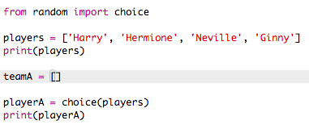

## Random players

Let's choose random players!

+ To be able to get a random player from your `players` list, first you'll need to import the `choice` part of the `random` module.

	

+ To get a random player, you can use `choice`. (You can also delete the code to print individual players.)

	

+ Test your `choice` code a few times and you should see a different player being chosen each time.

+ You can also create a new variable called `playerA`, and use it to store your random player.

	

+ You'll need a new list to store all of the players in team A. To start with, this list should be empty.

	

+ You can now add your randomly chosen player to `teamA`. To do this, you can use `teamA.append` (__append__ means add to the end).

	

+ Now that your player has been chosen, you can remove them from your list of `players`.

	

+ Test this code by adding a `print` command, to show the `players` left to choose from.

	

	In the example above, Hermione has been chosen for `teamA`, and so has been removed from the list of `players`.

