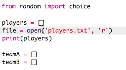

## Files

You can use a file to store your list of players.

+ Click the + icon and create a new file called `players.txt`.

	

+ Add your players to your new file. Make sure that there is no blank line after your last player.

	

+ Change your `players` list so that it is empty.

	

+ Open your `players.txt` file (the `'r'` means read-only).

	

+ Read the list from the file and add to your `players` list. (The `splitlines` code means that every line in the file is a new item in the `players` list).

	

+ If you test your code, it should work exactly the same as before. However, now it's much easier to add players to your `players.txt` file.

